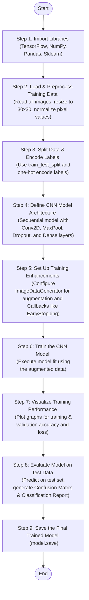

# 🚦 Traffic Sign Classification using CNN


## Project Structure 


## 🧠 Overview

This project implements a CNN-based classifier capable of identifying **43 different traffic signs** from the [GTSRB dataset](https://benchmark.ini.rub.de/gtsrb_news.html). The goal is to accurately predict traffic sign categories using deep learning techniques.

---

## 🗂️ Project Structure

```

traffic-sign-classification/
│
├── traffic sign classification final.ipynb  # Full training & evaluation code
├── requirements.txt                         # Required Python packages
├── README.md                                # Project documentation
└── dataset/                                 # Training and testing images (user-provided)

```

---

## 🧠 Model Highlights

- **Architecture:** Convolutional Neural Network (CNN)
- **Input:** 30×30 RGB images
- **Output Classes:** 43 (e.g., Stop, Speed Limit, Yield)
- **Training Accuracy:** ~99%
- **Testing Accuracy:** ~95%+

---

## 🔧 Key Features

✅ Preprocessing (resizing, normalization)  
✅ CNN with Conv2D, MaxPooling2D, Dropout, Dense layers  
✅ Model training with validation  
✅ Evaluation on unseen test set  
✅ Real-time prediction on custom images  
✅ Performance visualization (plots & confusion matrix)

---

## 📊 Dataset Information

- **Dataset:** [German Traffic Sign Recognition Benchmark (GTSRB)](https://benchmark.ini.rub.de/gtsrb_news.html)
- **Images:** ~50,000+ labeled samples
- **Categories:** 43 traffic signs

---

## 📥 How to Get the Dataset

1. Go to the [GTSRB Download Page](https://benchmark.ini.rub.de/Dataset_GTSRB.html)
2. Download the dataset
3. Extract and place it as follows:

```

traffic-sign-classification/
└── dataset/
├── Train/
└── Test/

````

---

## 🚀 Getting Started

### 1️⃣ Clone the Repository

```bash
git clone https://github.com/yousseifmustafa/Traffic-Sign-Recognition-and-Classification.git
cd Traffic-Sign-Recognition-and-Classification
````

### 2️⃣ Install Dependencies

```bash
pip install -r requirements.txt
```

> ✅ Works with Python 3.7+

### 3️⃣ Launch the Notebook

```bash
jupyter notebook "traffic sign classification final.ipynb"
```

---

## 🧪 Example Use Case

Upload a traffic sign image and the trained model will:

* Preprocess it (resize to 30×30)
* Predict the correct traffic sign class
* Output the class label with confidence

---

## 📈 Evaluation Metrics

* Accuracy & Loss curves
* Confusion Matrix
* Optional: Precision, Recall, F1-Score

---

## 📊 Visualizations

📌 Training vs Validation Accuracy
📌 Training vs Validation Loss
📌 Confusion Matrix for detailed performance

---

## 🌱 Future Enhancements

* Data Augmentation for better generalization
* Transfer Learning (e.g., ResNet, MobileNet)
* Web/mobile app integration for real-time use
* Add object detection with bounding boxes

---

## 🙋‍♂️ Author

Made with ❤️ by [Yousseif Mustafa](https://github.com/yousseifmustafa)

```
